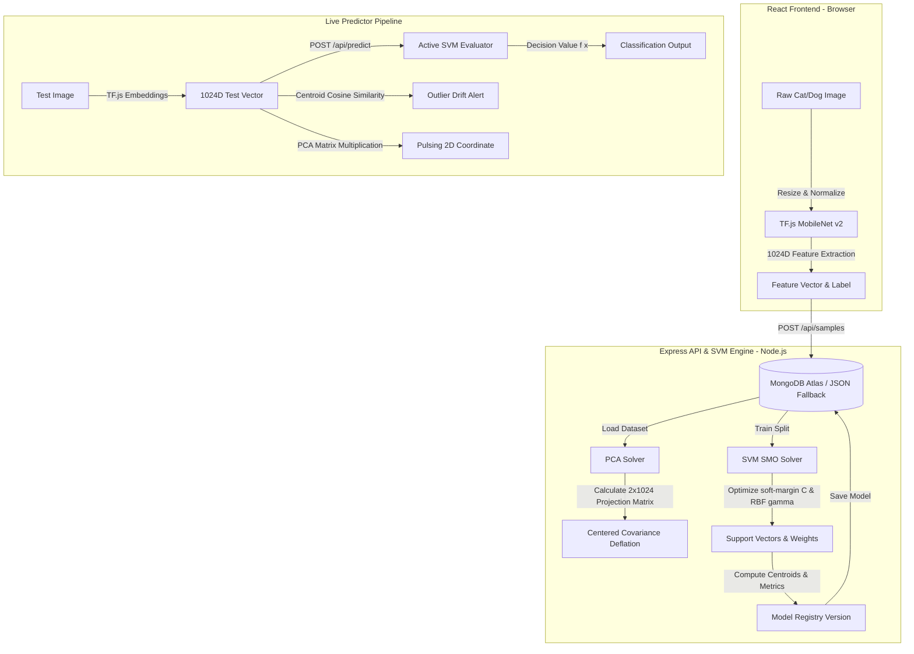
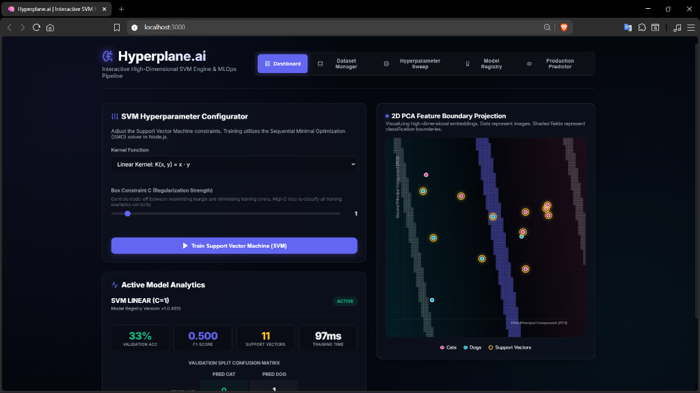
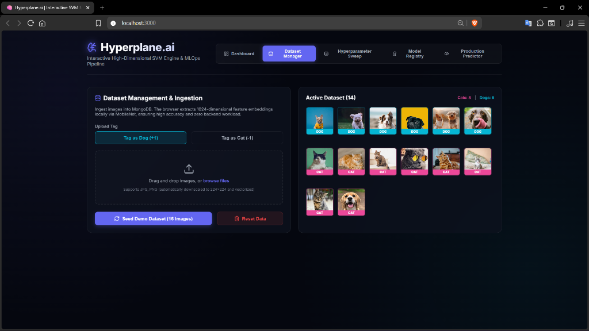
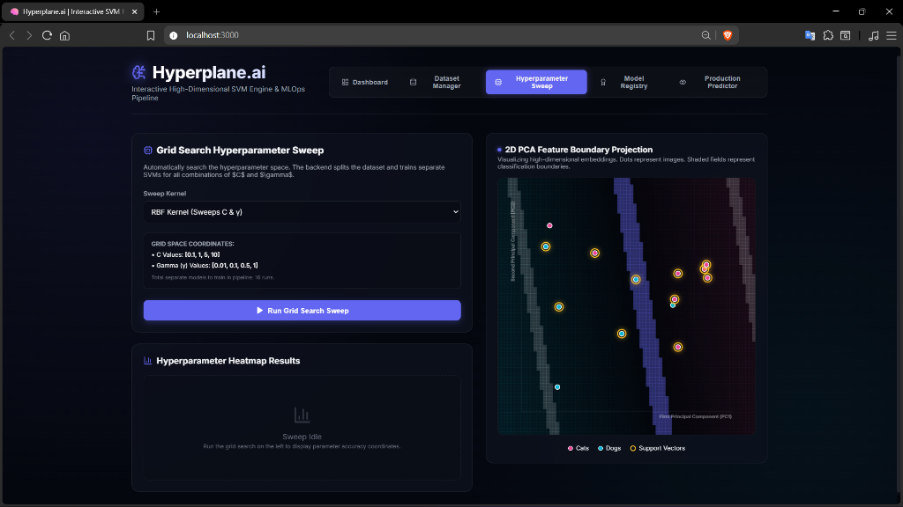

# Hyperplane.ai 🧠
> **Interactive High-Dimensional SVM Engine & MLOps Pipeline**

Hyperplane.ai is a production-grade machine learning platform built entirely in the **MERN (MongoDB, Express, React, Node.js) stack**. It allows developers and recruiters to ingest image datasets, train a Support Vector Machine (SVM) classifier in real-time, perform PCA dimensionality reduction for visual inspection, manage model versioning in a registry, and run production inference with data drift alerts.

By moving away from simple python scripts, this platform showcases full-stack systems engineering, interactive browser GPU computing, and MLOps lifecycle design.

---

## 🚀 Key Features

* **WebGL-Accelerated Feature Extraction**: Utilizing in-browser TensorFlow.js and a Google-hosted MobileNet v2 network to extract 1024-dimensional feature embeddings from images. This keeps server CPU loads at zero and enables instant, GPU-driven client processing.
* **Pure JavaScript Mathematical Engine**: Custom implementations of the **Sequential Minimal Optimization (SMO)** algorithm for training linear/RBF kernel SVMs and a matrix-free **Principal Component Analysis (PCA)** solver with power-iteration deflation to project 1024D embeddings to 2D coordinates.
* **Database-Backed Model Registry**: Complete history of training runs saved in MongoDB. Allows side-by-side inspection of hyperparameter changes, accuracies, training speeds, and validation-split confusion matrices.
* **Production Data-Drift Monitor**: Compares incoming inference images against training centroids in the 1024D feature space. If a non-distribution image is uploaded (e.g. a car instead of a cat/dog), the model triggers a warning alert.
* **Self-Healing Local JSON Fallback**: If local MongoDB is unavailable during startup, the server automatically hooks into a local JSON database file (`database_fallback.json`), ensuring the application remains 100% functional out-of-the-box in any local environment.

---

## 📊 Data & Training Pipeline

The diagram below outlines the full lifecycle of data ingestion, training, projection, and live inference:



---

## 📂 Project Structure

```
svm-mlops-platform/
├── assets/                    # Project screenshots for documentation
│   ├── dashboard.png
│   ├── dataset.png
│   └── sweep.png
├── backend/                   # Node.js + Express API Backend
│   ├── models/                # Mongoose Database Schemas
│   │   ├── Sample.js          # Raw image URLs and 1024D features
│   │   └── SVMModel.js        # SVM parameters, support vectors, PCA matrix, centroids
│   ├── routes/                # Express API endpoint controllers
│   │   └── svmRoutes.js
│   ├── utils/                 # Numerical solvers & DB failover
│   │   ├── db.js              # Mongoose database & JSON fallback wrapper
│   │   └── svmSolver.js       # Pure-JS SMO SVM Solver & PCA Power Iteration
│   ├── .env                   # Local backend env variables
│   ├── database_fallback.json # Local failover database (auto-generated)
│   ├── package.json
│   └── server.js              # Express entry point
├── frontend/                  # React + Vite Frontend
│   ├── public/
│   ├── src/
│   │   ├── components/        # Dashboard layout views
│   │   │   ├── Dashboard.jsx            # SVM controller and metrics
│   │   │   ├── DatasetManager.jsx       # Seeding and file ingestion
│   │   │   ├── HyperparameterSweep.jsx  # Grid search sweep and heatmap
│   │   │   ├── ModelRegistry.jsx        # Registry and comparator
│   │   │   ├── PCABoundaryCanvas.jsx    # 2D PCA coordinate & decision map
│   │   │   └── PredictorPanel.jsx       # In-distribution testing and drift alert
│   │   ├── utils/
│   │   │   └── featureExtractor.js      # Browser TFJS MobileNet extractor
│   │   ├── App.jsx            # Main app shell and state coordination
│   │   ├── index.css          # Sleek glassmorphism stylesheet
│   │   └── main.jsx           # React app mount & Axios configuration
│   ├── index.html
│   ├── package.json
│   └── vite.config.js
├── package.json               # Root monorepo workspace runner
└── README.md                  # Project documentation
```

---

## 🖼️ Application Showcases

### 1. Interactive Hyperplane Dashboard
Visualizing high-dimensional features projected down to 2D PC1/PC2 spaces. The gold rings highlight the actual support vectors, and the background coordinates denote classification boundaries.


### 2. Dataset Management & Local Ingestion
Manage raw image files and tag categories. Features a one-click GPU seeding button to pull Unsplash samples.


### 3. Hyperparameter Sweeps & Grid Tuning
Automated RBF grid sweeps. Simulates training runs over parameters and plots a colored heatmap of validation accuracies.


---

## 🛠️ Local Installation & Development

### Prerequisites
* [Node.js](https://nodejs.org/) (v16+ recommended)
* Optional: Local [MongoDB](https://www.mongodb.com/) (otherwise, server falls back automatically to local file storage)

### Quick Start
1. Clone the project repository.
2. In the root directory, install all parent, backend, and frontend packages:
   ```bash
   npm run install-all
   ```
3. Boot the backend and frontend concurrently in development mode:
   ```bash
   npm run dev
   ```
4. Open your browser and navigate to: [http://localhost:3000/](http://localhost:3000/)

---

## 🌐 Production Deployment Guide

### 1. Backend (Render Deployment)
1. Link your GitHub repository to [Render](https://render.com/) and create a **Web Service**.
2. Set **Root Directory** to `backend`.
3. Set **Build Command** to `npm install` and **Start Command** to `npm start`.
4. Add environment variables in Render:
   * `MONGODB_URI`: `mongodb+srv://<username>:<password>@cluster.mongodb.net/hyperplane_db` *(Your MongoDB Atlas String)*

### 2. Frontend (Vercel Deployment)
1. Link your GitHub repository to [Vercel](https://vercel.com/) and create a project.
2. Set **Root Directory** to `frontend`.
3. Vercel will auto-detect Vite. Under **Environment Variables**, add:
   * `VITE_API_URL`: `https://your-backend-service.onrender.com` *(Your Render domain)*
4. Click deploy.
